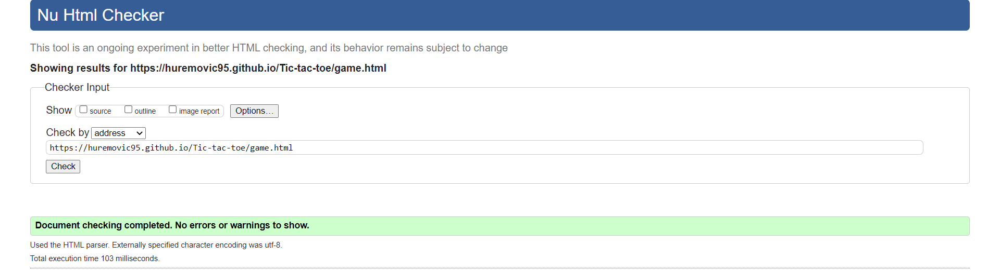

<h1> Tic Tac Toe </h1>

Tic Tac Toe is a javascript game built to allow two users to play a tic tac toe game against each other by passing the mouse.

<a href="https://huremovic95.github.io/Tic-tac-toe/" target="_blank">Tic Tac Toe live link </a>

<h3> Techsini Multi Mockup </h3>

 

<h1> Features </h1>

<h2> Favicon </h2>
<ul>
<li>A site wide favicon will be implemented with a grid of the Tic Tac Toe game</li>
<li>This will provide an image in the the tabs header to allow the user to easily identify the website if they have multiple tabs open.</li>
</ul>

 

<h2> 404 Page </h2>
<ul>
<li>A 404 page will be implemented and will display if a user navigates to a broken link.</li>
<li>The 404 page will allow the user to easily navigate back to the main website if they direct to a broken link / missing page, without the need of the browsers back button.</li>
</ul>

 

<h2> Main Page </h2>

<ul>
<li>There is a game information section explaining the instruction and win condition.</li>
<li>Also there is a section about the game's history</li>
</ul>

<ul>
<li>A Start Game Button will be on the home page that when clicked will direct the user to the main game.</li>
</ul>

 

<h2> Game Page </h2>

<ul>
<li> The game grid has 9 cells that are responsive to the user when clicked. Depending if it's x or o's turn the cell will show the symbol of the current player. When a cell is already occupied and the user clicks on it nothing will happen.</li>

<li>The Players Turn section shows which players turn it is and changes after every play and at the beginning of the game the player that starts also changes.</li>

<li>The Player Score section shows the score(win's) of the X and of the O player. After a win the user gets one added to his or her score.</li>

<li>At the end of the game when a player wins or when the game is a draw, a section pops up with information who won (or draw) and gives the users the option to play again or go back to the Home page.</li>

</ul>

 

<h2> Features left to implement </h2>

<ul>
<li>Add a form where the users can put in their names and it shows in game. Instead of X turn and X score {player} name and {player} turn.</li>
</ul>

 

<h1> Testing </h1>

<h2> Responsiveness </h2>

All pages were tested to ensure responsiveness on screen sizes from 320px and upwards as defined in <a href="https://www.w3.org/WAI/WCAG21/Understanding/reflow.html" target="_blank">WCAG 2.1 Reflow criteria for responsive design</a> on Chrome, Edge, Firefox and Opera browsers.

Steps to test:

<ol>
<li>Open browser and navigate to <a href="https://huremovic95.github.io/Tic-tac-toe/game.html">Tic tac toe</a></li>
<li>Open the developer tools (right click and inspect)</li>
<li>Set to responsive and decrease width to 320px</li>
<li>Set the zoom to 50%</li>
<li>Click and drag the responsive window to maximum width</li>
</ol>

Expected:

Website is responsive on all screen sizes and no images are pixelated or stretched. No horizontal scroll is present. No elements overlap.

Actual:

Website behaved as expected.

Website was also opened on the following devices and no responsive issues were seen:

<ul>
<li>Iphone 12</li>
<li>Ipad air</li>
</ul>

 

<h2> Accessibility </h2>

Wave Accessibility tool was used throughout development and for final testing of the deployed website to check for any aid accessibility testing.

The website has no errors when passing through the official <a href="https://wave.webaim.org/aim/" target="_blank">Wave Accessiblility.</a>

 

<h2> Validator Testing </h2>

<ul>
<li>HTML</li>
<ul><li>No errors were returned when passing through the official <a href="https://validator.w3.org/" target="_blank">W3C validator</a></li></ul>
</ul>

 

 

 

<ul>
<li>CSS</li>
<ul><li>No errors were returned when passing through the official <a href="https://jigsaw.w3.org/css-validator/" target="_blank">(Jigsaw) validator</a></li></ul>
</ul>

 

<ul>
<li>Javascript</li>
<ul><li>No errors were returned when passing through the official <a href="https://jshint.com/" target="_blank">JShint validator</a></li>
<li>32 warnings appeared all of them are saying the same that: 
'let' is available in ES6 (use 'esversion: 6') or Mozilla JS extensions (use moz).</li></ul>
</ul>

 

<h2> Lighthouse Report </h2>

Index page

Game page

 

<h2> Game Play </h2>

<h3> Starting the game </h3>

The start game button in the index page when clicked starts the game. After clicking on the main page button in the game page the start game button still starts the game. When clicking on the restart game button in the game page the game restarts. When clicked on the back button in the browser in the game page and after that clicking on the start game button it still works.

<h3> Clicking on cell's </h3>

every cell got clicked it changes the innertext of that cell to the current player (x or o) and it changes the current player (also displays the current player). When clicking on an already occupied cell it does not change the cell anymore and it also doesn't change the current player (stays the same).

<h3> Win conditions </h3>

All possible win conditions were tested and they all work. When a player wins the end game section pops up with an option to play another game and to go back to the main page. The Player that won gets a plus one to his or her score after a win. If none of the players win and all cells are occupied the end game section pops up with "It's a draw" as text and the score of both players stay the same.

<h3> Changing of players </h3>

After every turn(cell clicked) the current player changes. The first game player X begins, if the another game button is clicked the next game player O begins. The beginning player keeps going back and forth whenever the another game button is clicked. When the main page button is clicked and the users start a new game player X is the one that starts.

<h3> End of a game </h3>

At the end of the game no matter what the result is all cells go back to being empty (after button is clicked). The winning players score also increments by one. If the users go back to the main page and start a new game the scores will go back to 0. If the users keep playing another game the scores keep on adding up when needed. Main page button does what it needs to and the another game button does what it needs to do.

 

<h1> Technologies </h1>

<ul>
<li>HTML</li>
<ul><li>The structure of the Website was developed using HTML.</li></ul>
</ul>

<ul>
<li>CSS</li>
<ul><li>The Website was styled using custom CSS in an external file.</li></ul>
</ul>

<ul>
<li>Javascript</li>
<ul><li>The game play logic was created using JavaScript in an external file.
</li></ul>
</ul>

<ul>
<li>Visual Studio Code</li>
<ul><li>The website was developed using Visual Studio Code.</li></ul>
</ul>

<ul>
<li>Github</li>
<ul><li>Source code is hosted on GitHub and delpoyed using Git Pages.</li></ul>
</ul>

<ul>
<li>Git</li>
<ul><li>Used to commit and push code during the development of the Website.</li></ul>
</ul>

 

<h1> Deployment </h1>

<h2> Version Control </h2>

The site was created using the Visual Studio Code editor and pushed to github to the remote repository ‘Tic-tac-toe’.

The following git commands were used throughout development to push code to the remote repo:

git add file / git add . - This command was used to add the file(s) to the staging area before they are committed.

git commit -m “message” - This command was used to commit changes to the local repository queue ready for the final step.

git push - This command was used to push all committed code to the remote repository on github.

<h2> Deployment to Github pages </h2>

<ul>
<li>The site was deployed to GitHub pages. The steps to deploy are as follows:</li>
<ul>
<li>In the GitHub repository, navigate to the Settings tab</li>
<li>From the menu on left select 'Pages'</li>
<li>From the source section drop-down menu, select the Branch: main</li>
<li>Click 'Save'</li>
<li>A live link will be displayed in a green banner when published successfully.</li>
</ul>
</ul>

 

<h1> Credits </h1>

<ul>
<li><a href="https://www.w3schools.com/" target="_blank">W3school</a> was used to solve some problems/ look some things up but mostly i needed to word it in my own code/words</li>
<li><a href="https://stackoverflow.com/" target="_blank">Stackoverflow</a> was used to solve some problems/ look some things up but mostly i needed to word it in my own code/words</li>
<li><a href="https://www.geeksforgeeks.org/" target="_blank">Geeksforgeeks</a> was used to solve some problems/ look some things up but mostly i needed to word it in my own code/words</li>
<li><a href="https://dev.to/pat_the99/how-to-remove-outside-borders-of-a-3x3-grid-using-css-e-g-tic-tac-toe-ui-4ao8" target="_blank">Remove the outside borders of a 3x3 grid</a> CSS code was copied and pasted to get rid of the outside borders (top, right, bottom, left) of the game grid</li>
<li><a href="https://stackoverflow.com/questions/66001788/tic-tac-toe-winning-condition-checks-confused" target="_blank">The Checkwinner funtion</a> This code that checks the winning condition was copied and pasted with some small changes. It checks if any of the win conditions are true.</li>
</ul>