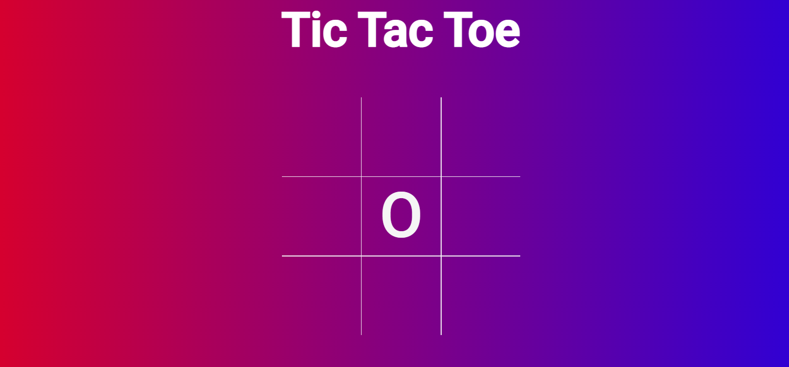

<h1> Tic Tac Toe </h1>

Tic Tac Toe is a javascript game built to allow two users to play a tic tac toe game against each other by passing the mouse.

<a href="https://huremovic95.github.io/Tic-tac-toe/" target="_blank">Tic Tac Toe live link </a>

<h3> Techsini Multi Mockup </h3>

 

<h1> Features </h1>

<h2> Favicon </h2>
<ul>
<li>A site wide favicon will be implemented with a grid of the Tic Tac Toe game</li>
<li>This will provide an image in the the tabs header to allow the user to easily identify the website if they have multiple tabs open.</li>
</ul>

 

<h2> 404 Page </h2>
<ul>
<li>A 404 page will be implemented and will display if a user navigates to a broken link.</li>
<li>The 404 page will allow the user to easily navigate back to the main website if they direct to a broken link / missing page, without the need of the browsers back button.</li>
</ul>

 

<h2> Main Page </h2>

<ul>
<li>There is a game information section explaining the instruction and win condition.</li>
<li>Also there is a section about the game's history</li>
</ul>

<ul>
<li>A Start Game Button will be on the home page that when clicked will direct the user to the main game.</li>
</ul>

 

<h2>Game Page</h2>

<ul>
<li> The game grid has 9 cells that are responsive to the user when clicked. Depending if it's x or o's turn the cell will show the symbol of the current player. When a cell is already occupied and the user clicks on it nothing will happen.</li>

<li>The Players Turn section shows which players turn it is and changes after every play and at the beginning of the game the player that starts also changes.</li>
<li>The Player Score section shows the score(win's) of the X and of the O player. After a win the user gets one added to his or her score.</li>

<li>At the end of the game when a player wins or when the game is a draw, a section pops up with information who won (or draw) and gives the users the option to play again or go back to the Home page.</li>

</ul>

 

<h2>Features left to implement</h2>

<ul>
<li>Add a form where the users can put in their names and it shows in game. Instead of X turn and X score {player} name and {player} turn.</li>
</ul>

 

<h1> Testing </h1>

<h2> Responsiveness </h2>

